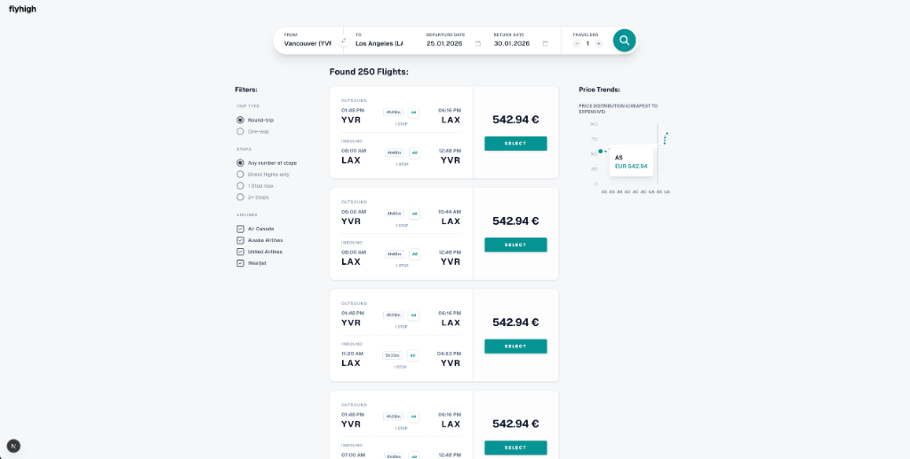
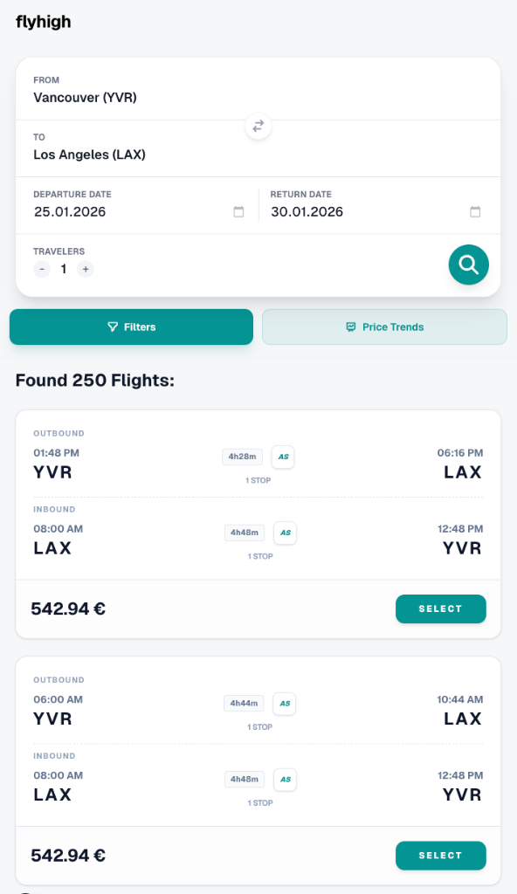

# FlyHigh ✈️

**FlyHigh** is a premium, high-performance flight search engine built with modern web technologies. It provides a seamless user experience for finding the best flight deals with real-time data and stunning visual feedback.

## ✨ Features

- 🔍 **Real-time Flight Search**: Integrated with the Amadeus API for accurate, up-to-date flight offers.
- 🖼️ **Dynamic Visuals**: Immersive landing page with a dynamic slideshow featuring beautiful global destinations.
- 📊 **Price Trends**: Visualized price data using Recharts to help users find the best time to book.
- 🛠️ **Advanced Filtering**: Filter by stops, carriers, and trip types (Roundtrip/One-way).
- 📱 **Fully Responsive**: Optimized for Mobile, Tablet, and Desktop with a premium look and feel.
- ⚡ **Modern Stack**: Built with Next.js 16 (App Router), React 19, and Tailwind CSS 4.

## 🚀 Tech Stack

- **Framework**: [Next.js 16](https://nextjs.org/)
- **UI & Logic**: [React 19](https://reactjs.org/)
- **Styling**: [Tailwind CSS 4](https://tailwindcss.com/)
- **Data Visualization**: [Recharts](https://recharts.org/)
- **API**: [Amadeus SDK](https://github.com/amadeusitgroup/amadeus-node)
- **Language**: [TypeScript](https://www.typescriptlang.org/)

## 🛠️ Getting Started

### Prerequisites

You'll need an Amadeus API key. Register at [Amadeus for Developers](https://developers.amadeus.com/).

### Installation

1. Clone the repository:
   ```bash
   git clone https://github.com/urateb/flyhigh.git
   cd flyhigh
   ```

2. Install dependencies:
   ```bash
   npm install
   ```

3. Set up environment variables:
   Create a `.env.local` file in the root directory and add your Amadeus credentials:
   ```env
   AMADEUS_CLIENT_ID=your_client_id
   AMADEUS_CLIENT_SECRET=your_client_secret
   ```

4. Run the development server:
   ```bash
   npm run dev
   ```

Open [http://localhost:3000](http://localhost:3000) with your browser to see the results.

## 📸 Screenshots

### Landing Page


### Search Results & Price Trends


### Mobile & Filter View

