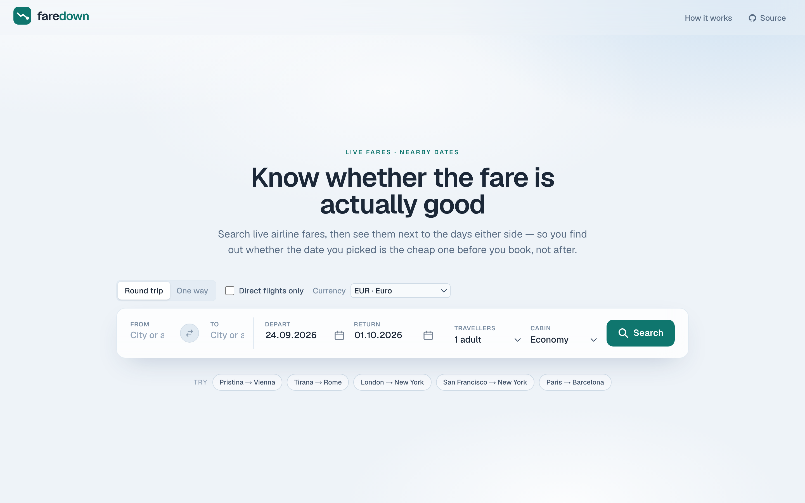
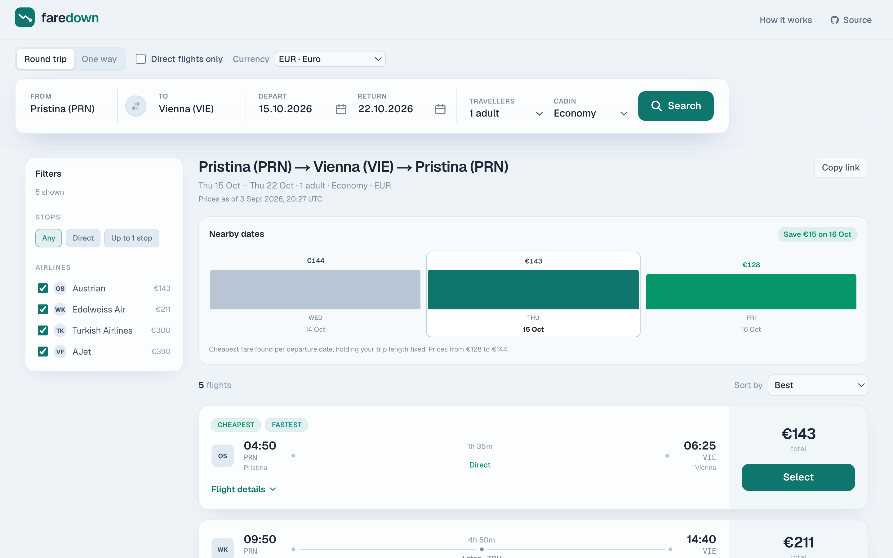
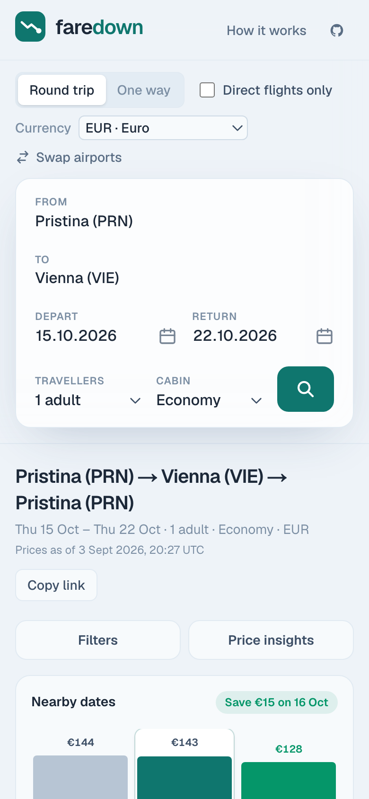
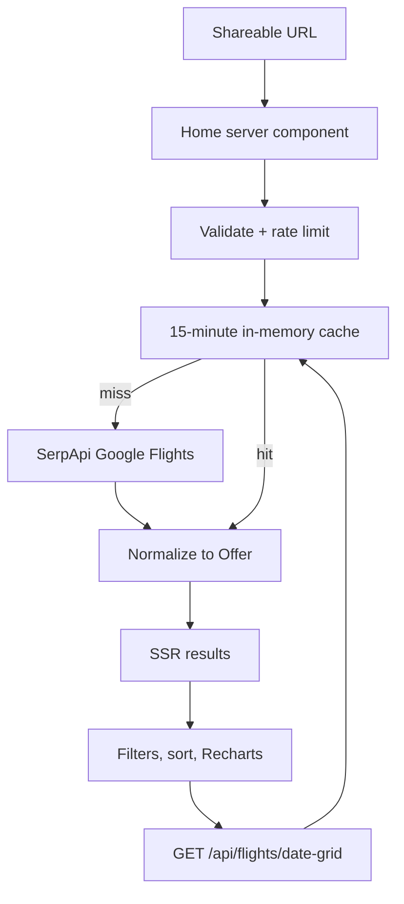

# Faredown

**Know whether the fare is actually good.**

Faredown is a flight search you can share. It retrieves current offers and pricing through the [Google Flights data API](https://serpapi.com/google-flights-api), prices the days either side of your departure, and hands you off to the airline or a booking site. It does not sell tickets.

A result is encoded entirely in the URL. Opening a Faredown link renders that search on the server, with no empty first paint and no client-side waterfall.

**Live:** [faredown.vercel.app](https://faredown.vercel.app)

## Screenshots

### Landing


### Search results


### Mobile


## Features

- **Live Flight Search:** Retrieves current flight offers and pricing through the Google Flights data API, with server-side caching to reduce unnecessary external requests.
- **Nearby dates:** Prices neighbouring departures while holding trip length fixed, so you can see whether the day you picked is the cheap one.
- **Price vs duration:** Recharts plots returned fares so a small saving is never confused with a long layover.
- **Filters:** Stops, carriers, and trip type (round-trip / one-way).
- **Booking hand-off:** Opens the airline, Google Flights, Kayak, or Skyscanner with the route and dates filled in. There is no fake checkout.

## Architecture



The query string (`from`, `to`, `depart`, `return`, …) *is* the search. The home page is a server component: it validates those params, rate-limits the caller, and either serves a cached SerpApi response or fetches a new one. Offers are normalized into a single `Offer` model and rendered on the first paint.

Refinement after that — stops, carriers, sort, and the price-vs-duration chart — runs in the browser against that result set, so a shared link always reproduces the same flights rather than someone else’s narrowed view. Neighbouring dates hit `/api/flights/date-grid`, which reuses the same cache so the selected day is not billed twice.

The API key stays on the server as `SERPAPI_KEY`. It is never sent to the browser.

## Stack

- **Framework:** [Next.js 16](https://nextjs.org/) (App Router)
- **UI:** [React 19](https://react.dev/) · [Tailwind CSS 4](https://tailwindcss.com/)
- **Charts:** [Recharts](https://recharts.org/)
- **Flight data:** [SerpApi Google Flights](https://serpapi.com/google-flights-api)
- **Language:** [TypeScript](https://www.typescriptlang.org/)
- **Tests:** [Vitest](https://vitest.dev/) · [Playwright](https://playwright.dev/)

## Setup

You need a SerpApi key. The key stays on the server as `SERPAPI_KEY` and is never sent to the browser. Locally it lives in `.env.local`. On Vercel, add the same variable under Project → Settings → Environment Variables (Production), then redeploy.

1. Register at [serpapi.com/users/sign_up](https://serpapi.com/users/sign_up) (250 free searches/month).
2. Copy the API key from the dashboard.
3. Clone, install, and configure:

```bash
git clone https://github.com/urateb/faredown.git
cd faredown
npm install
npx playwright install chromium
cp .env.example .env.local
```

```env
SERPAPI_KEY=your_key_here
NEXT_PUBLIC_DEFAULT_CURRENCY=EUR
NEXT_PUBLIC_SITE_URL=http://localhost:3000
```

4. Run the development server:

```bash
npm run dev
```

Open [http://localhost:3000](http://localhost:3000).

### Caching

Identical searches are cached in memory for 15 minutes. SerpApi also does not bill a repeat of the same query within an hour. Refreshing a results link should not spend another search. The nearby-dates grid reuses that cache so the selected day is not billed twice.

## Scripts

| Command | What it does |
| --- | --- |
| `npm run dev` | Development server |
| `npm run build` | Production build |
| `npm test` | Vitest |
| `npm run test:e2e` | Playwright (landing page; does not call SerpApi) |
| `npm run typecheck` | `tsc --noEmit` |
| `npm run lint` | ESLint |
| `npm run format` | Prettier |
